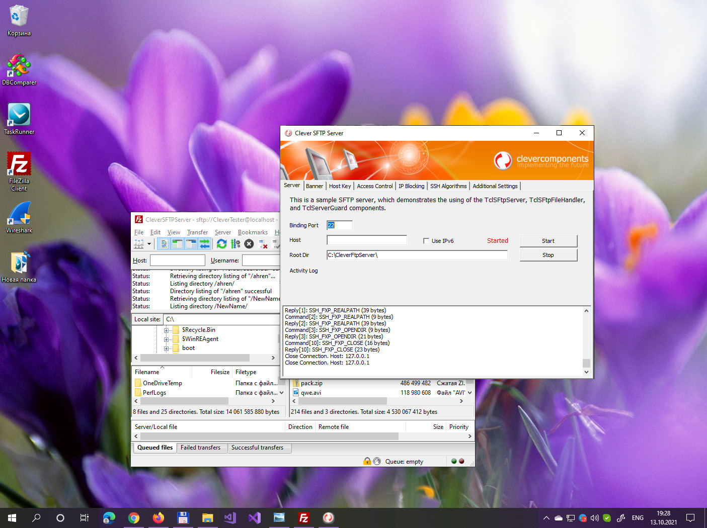

# Clever SFTP Server

The program implements a fully functional SFTP server with multi-session support, which works via the SSH File Transfer Protocol.   

This C# project represents a mostly simple demos and by no means, a complete application. It's intended to demonstrate how to use the [SFTP Server](https://www.clevercomponents.com/products/inetsuite/sftpserver.asp) component in your C# .NET application. Additionally, the program uses the [Server Guard](https://www.clevercomponents.com/products/inetsuite/serverguard.asp) component, which protects the server from external attacks, such as brute-force, connection flood, and other malicious activity.   

The server allows you to define the listening port and the local binding host, load or generate an RSA host key, and choose cryptographic and integrity algorithms, which will be used during the SSH session.   

The current program interface allows you to define one single user account with it's personal user directory and access permissions. You are free to extend this functionality, because the [SFTP Server](https://www.clevercomponents.com/products/inetsuite/sftpserver.asp) component supports multiple user accounts.   

How to compile:   
1. Please clone the [GitHub/CleverComponents/Clever-Internet-Suite-Examples](https://github.com/CleverComponents/Clever-Internet-Suite-Examples) repository.
2. Download and install the [Clever Internet .NET Suite](https://www.clevercomponents.com/downloads/inetsuite/suitenetdownload.asp) library.
3. Open and compile the SFtpServer project in your Visual Studio IDE.
4. Enjoy.

Please feel free to [Contact Us](https://www.clevercomponents.com/support/) and ask any program related questions.   

Keep updated on [Facebook](http://www.facebook.com/clevercomponents)   [YouTube](https://www.youtube.com/channel/UC9Si4WNQVSeXQMjdEJ8j1fg)   [Twitter](https://twitter.com/CleverComponent)   [Telegram](https://t.me/clevercomponents)   [Newsletter](https://www.clevercomponents.com/home/maillist.asp)   
