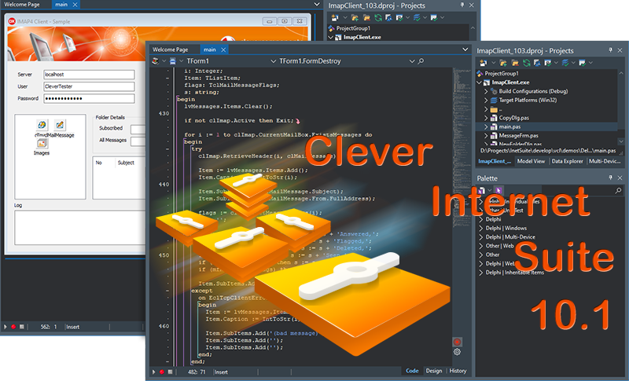

# Clever IMAP Client

The program implements a mail IMAP client, which connects to the specified mailbox over the IMAP4 protocol, browses/modifies IMAP folders, and displays emails within the selected folder.   

This Delphi project represents a mostly simple demos and by no means, a complete application. It's intended to demonstrate how to use the [IMAP4](https://www.clevercomponents.com/products/inetsuite/imap.asp) component in your Delphi application. Additionally, the program uses the [MailMessage](https://www.clevercomponents.com/products/inetsuite/messageparser.asp) component, which allows you to create and parse emails in the MIME format, including message headers, text- and HTML bodies, file attachments, and embedded images.   

The program allows you to authenticate using the username/password information. Also, the IMAP4 component supports the OAUTH2.0, Digest, NTLM, and other authentication methods. Please check out the other example to learn how to use the OAUTH2.0 protocol together with this components: [GMail IMAP Client](https://github.com/CleverComponents/Clever-Internet-Suite-Examples/tree/master/Delphi/GMailIMAP)   

The IMAP4 client component completely supports the SSL/TLS mode, including the client certificate authorization and the server validation process. The following example shows how to connect to a mail server via TLS: [IMAP Client SSL](https://github.com/CleverComponents/Clever-Internet-Suite-Examples/tree/master/Delphi/ImapClientSSL)   

How to compile:   
1. Please clone the [GitHub/CleverComponents/Clever-Internet-Suite-Examples](https://github.com/CleverComponents/Clever-Internet-Suite-Examples) repository.
2. Download and install the [Clever Internet Suite](https://www.clevercomponents.com/downloads/inetsuite/suitedownload.asp) library.
3. Open and compile the ImapClient project in your Delphi IDE.
4. Enjoy.

Please feel free to [Contact Us](https://www.clevercomponents.com/support/) and ask any program related questions.   

Keep updated on [Facebook](http://www.facebook.com/clevercomponents)   [YouTube](https://www.youtube.com/channel/UC9Si4WNQVSeXQMjdEJ8j1fg)   [Twitter](https://twitter.com/CleverComponent)   [Telegram](https://t.me/clevercomponents)   [Newsletter](https://www.clevercomponents.com/home/maillist.asp)   
